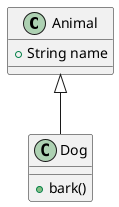

``` org

# Images
#+CAPTION: This is the caption for the next figure link (or table)
#+NAME:   fig:SED-HR4049
[[./img/a.jpg]]

# Image with custom width
#+attr_html:  :width 1000px
#+attr_org:  :width 1000
[[~/images/examples.jpg]]

# Link to a specific section in an org mode document called Golang Tutorial
[[file:005-Golang.org::*Golang Tutorial][Golang Tutorial]]

# Footnotes
The Org website [fn:50] now looks a lot better than it used to.
[fn:50] The link is: https://orgmode.org

# Specify file variables in first line of file
# https://www.gnu.org/software/emacs/manual/html_node/emacs/Specifying-File-Variables.html
,# -*- org-image-actual-width: nil; org-imenu-depth: 5 -*-

# Turn on inline images in Org Mode anywhere in buffer
# https://orgmode.org/manual/In_002dbuffer-Settings.html
,,#+STARTUP: inlineimages

# Run a specific program using :shebang
# https://orgmode.org/worg/org-contrib/babel/languages/ob-doc-shell.html
#+begin_src sh :shebang #!/home/user/.nix-profile/bin/nu :results output
ls
#+end_src

# Python session like Jupyter Note books
# Source: https://rgoswami.me/posts/jupyter-orgmode/
# Set the environment Python binary in the properties for the file
# Specific at section heading
#+PROPERTY: header-args:python :python /home/user/Code/myproject/.venv/bin/python :session One :results output :exports both
#+title: Emacs org mode like Jupyter
* Python Session

# or properties block in a section heading
,:PROPERTIES:
,:header-args:    :python /home/user/Code/myproject/.venv/bin/python :session One :results output file :exports both
,:END:

# Use Python like normal, note =:results output file :exports both= are required for
# either python source blocks or in the header arguments
#+begin_src python :results output file :exports both

import matplotlib.pyplot as plt

x = [1, 2, 3, 4]
y = [2, 4, 6, 8]

plt.plot(x, y)
plt.savefig('output.png')
# return filename to org-mode
print('output.png')
#+end_src

# Set Python command, such as a virtual environment to use
, #+begin_src emacs-lisp
(setq org-babel-python-command "/usr/bin/python3")
#+end_src

# Run Python code and show executable being used
#+begin_src python :results output
import sys
print(sys.executable)
print("Hello World")
#+end_src

# Output results as JSON or other code programming languages
#+begin_src sh :results output code :wrap src json
curl https://jsonplaceholder.typicode.com/todos/1
#+end_src

# Run a specific program using :shebang
# See https://orgmode.org/worg/org-contrib/babel/languages/ob-doc-shell.html
#+begin_src sh :shebang #!/home/user/.nix-profile/bin/nu :results output raw
sys host
#+end_src

# Run SQL
# https://orgmode.org/worg//org-contrib/babel/languages/ob-doc-sql.html
#+begin_src sql :engine mysql
  DESCRIBE `some_table`;
#+end_src

```

The following sections shows babel examples and results in org-mode

## Python execution

### Python session like Jupyter Note books

Source:
[https://rgoswami.me/posts/jupyter-orgmode/](https://rgoswami.me/posts/jupyter.mdmode/)

Set the environment Python binary in the properties for the file

Specific at section heading

or properties block in a section heading

,\* Python Session with Virtual Environment Set

### Running commands

Use Python like normal, note `:results output file :exports both` are
required for either python source blocks or in the header arguments

``` python

import matplotlib.pyplot as plt

x = [1, 2, 3, 4]
y = [2, 4, 6, 8]

plt.plot(x, y)
plt.savefig('output.png')
# return filename to org-mode
print('output.png')

```

Set Python command, such as a virtual environment to use

``` commonlisp
(setq org-babel-python-command "/usr/bin/python3")
```

Run Python code and show executable being used

``` python
import sys
print(sys.executable)
print("Hello World")
```

Run Python code with virtual environment

``` python
import sys
print("Hello from venv")
print(sys.executable)

```

Run Python code with uv

``` python
# /// script
# requires-python = ">=3.12"
# dependencies = [
#     "matplotlib",
# ]
# ///
import sys
print("Hello from uv")
print(sys.executable)
```

## Run a specific program using :shebang

See
[https://orgmode.org/worg/org-contrib/babel/languages/ob-doc-shell.html](https:/.orgmode.org/.md.md-contrib/babel/languages/ob-doc-shell.html)

This method can be used to run any command, programming language and get
its output with a specific path or in the user's PATH environment
variable

``` bash
sys host
```

Run shells available on path

``` bash
ps | where name =~ 'emacs'
```

Using !shebang with Racket, Python, and Deno examples

``` bash
#lang racket/base
(+ 1 1)
```

``` python
print("Hello from Python!")
```

``` bash
import * as R from "npm:ramda"

R.forEach( (i) => console.log(i), [1, 2, 3, 4])

```

## Output results as JSON or other code programming languages

``` bash
curl https://jsonplaceholder.typicode.com/todos/1
```

Using hurl for API testing, see [Org-mode and
Hurl](https://blog.wilcoxd.com/2025/04/03/Org-Mode-and-Hurl/), requires
[hurl-mode](https://github.com/JasZhe/hurl-mode) or run commands using
:shebang or regular shell

``` hurl
GET https://swapi.dev/api/people/1/

HTTP/2 200
```

Using hurl for passing variables

``` hurl
GET {{hostname}}/api/people/1
```

## PlantUML

Activate `inlineimages` in org-mode and output image file and adjust
width for better viewing



See more examples at [PlantUML
Snippets](/garden/notes/005-computer-snippets-plantuml) - [PlantUML
Snippets](id:c0360cd8-8ed4-45a4-9c5f-df8edc034cb5)

## SQL

Source: [SQL Source Code Blocks in Org
Mode](https:/.mdmode.md/.md/.md-contrib/babel/languages/ob-doc-sql.html)
with examples from [Ryan Prior / Emacs Org Data Starter ·
GitLab](https://gitlab.com/ryanprior/emacs.md-data-starter)

Make sure the corresponding sql binary is installed on the system like
sqlite3, psql, and others

``` sql
DESCRIBE `some_table`;
```

### Run R for SQL query

``` r
library(RMySQL)
con <- dbConnect(MySQL(), user="user", password="pwd", dbname="dbname", host="host")
q <-
<<quote-blks("my-query")>>
c <- dbGetQuery(con, q)
dbDisconnect(con)
c
```

Another option is the query could be set up to run on its own

``` sql
SELECT * FROM mytable
WHERE id > 500
```

### MySQL

1.  Connecting & running a basic query

    Follow the MySQL instructions in the [org-babel
    documentation](https:/.mdmode.md/.md/.md-contrib/babel/languages/ob-doc-sql.html).
    This example uses source block level properties.

    ``` sql
    SHOW TABLES;
    ```

2.  Loading data & running queries

    Uses subheader properties for the configuration instead of putting
    the configuration on every block. Use the source block level for one
    off qureies.

    1.  Create a database

        ``` sql
        create database if not exists org_test;
        ```

### PostgreSQL

1.  Connecting & running a basic query

    Follow the PostgresQL instructions in the [org-babel
    documentation](https:/.mdmode.md/.md/.md-contrib/babel/languages/ob-doc-sql.html)

    ``` sql
    \list
    ```

2.  Loading data & running queries using heading properties

    1.  Create a database

        ``` sql
        select 'CREATE DATABASE org_test' where not exists (SELECT FROM pg_database WHERE datname = 'org_test')\gexec
        ```

### SQLite

Follow the ob-sqlite instructions in the [org-babel
documentation](https:/.mdmode.md/.md.md-contrib/babel/languages/ob-doc-sqlite.html)

``` sql
select sqlite_version();
```

``` sql
select * from greeting;
```

1.  Loading data & running queries at heading level

    1.  Creating a new table & inserting some data

        ``` sql
        CREATE TABLE IF NOT EXISTS org_resources (
          id INT,
          resource TEXT,
          url TEXT
          );
        ```
